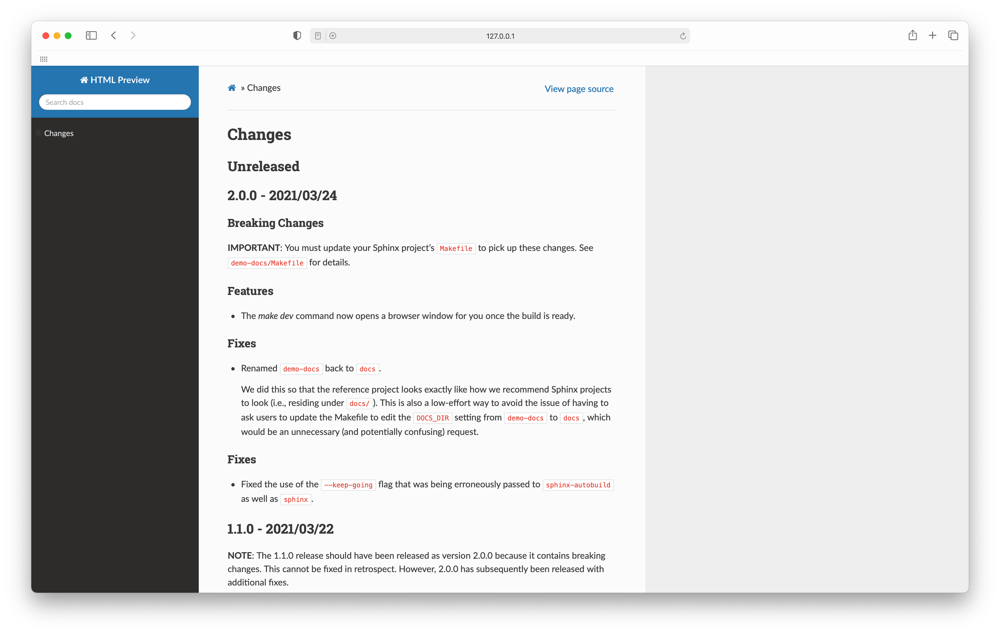

=======
Helpers
=======

This directory will collect helpers for working with the docs.

Preview RST
===========

The ``preview`` directory holds a script named ``preview-rst``. This script can
be used to preview RST files. This works for RST files that are a part of a
Sphinx project as well as working for standalone RST files (e.g.,
``DEVELOP.rst``).

**CAUTION**: This script is a work in progress and features may be added,
removed, or changed significantly.

For now, you may test this script as follows:

- Add the ``bin`` directory to your ``PATH``. For example::

      export PATH="/some/path/to/crate-docs/helpers/preview/bin:$PATH"

- Run ``preview-rst <RST_FILE>`` to preview an RST file (given as an argument
  in place of ``<RST_FILE>``).

If you run ``preview-rst`` on ``CHANGES.rst`` file at the root of this
repository, you should see something like this:

This script is not intended to be run by hand. It has been written with the
purpose of being integrated into a desktop editing environment. Integration is
possible if you are using an editor that allows you to extend its
functionality with arbitrary scripting.

In the future, wrappers for one or more specific editors will be included to
help you integrate this script into your workflow.
